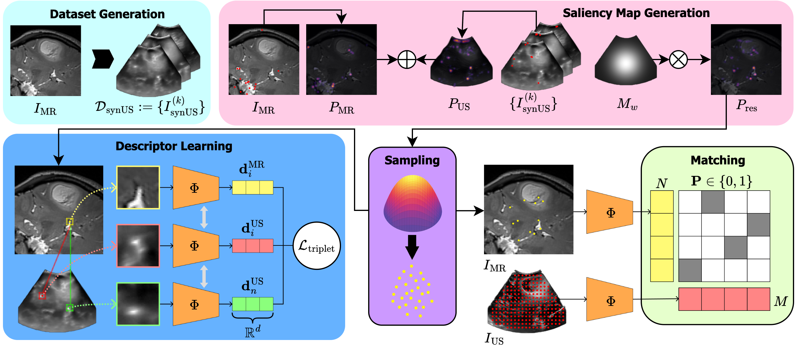

<p align="center">
  <h1 align="center">🔑 <ins>CrossKEY</ins><br>A framework for learning 3D Cross-modal Keypoint Descriptor for MR-US Matching and Registration</h1>
  <p align="center">
    Daniil Morozov<sup>1,2</sup>
    ·
    <a href="https://scholar.google.com/citations?user=xdECLMkAAAAJ&hl=fr">Reuben Dorent</a><sup>3,4</sup>
    ·
    <a href="https://scholar.google.com/citations?user=PjpzomsAAAAJ&hl=fr&oi=ao">Nazim Haouchine</a><sup>2</sup>
  </p>
  <p align="center">
    <sup>1</sup> Technical University of Munich (TUM), &nbsp;<sup>2</sup> Harvard Medical School, &nbsp;
    <sup>3</sup> Inria Saclay, &nbsp;
    <sup>4</sup> Sorbonne Université, Paris Brain Institute (ICM)
  </p>
</p>

<div align="center">

<a href="https://arxiv.org/abs/2507.18551"></a>
<a href="https://colab.research.google.com/placeholder"></a>
<a href="https://www.cancerimagingarchive.net/collection/remind/"></a>
<a href="#license"></a>

</div>

<div align="center">

<p align="center">
    
    <br>
    <em>CrossKEY enables robust 3D keypoint matching between MRI and iUS, achieving state-of-the-art performance both in image matching and registration tasks</em>
</p>

</div>

## 📋 TODO

- [X] **Essential Scripts**: Add training and testing scripts with test data example
- [ ] **Interactive Demo**: Create Colab notebook for easy experimentation
- [ ] **Visualization Functions**: Add utilities for keypoint and matching visualization

## 📋 Abstract

Intraoperative registration of real-time ultrasound (iUS) to preoperative Magnetic Resonance Imaging (MRI) remains an unsolved problem due to severe modality-specific differences in appearance, resolution, and field-of-view. To address this, we propose a novel 3D cross-modal keypoint descriptor for MRI–iUS matching and registration. Our approach employs a **patient-specific matching-by-synthesis approach**, generating synthetic iUS volumes from preoperative MRI. This enables supervised contrastive training to learn a shared descriptor space. A **probabilistic keypoint detection strategy** is then employed to identify anatomically salient and modality-consistent locations. During training, a curriculum-based triplet loss with dynamic hard negative mining is used to learn descriptors that are i) robust to iUS artifacts such as speckle noise and limited coverage, and ii) rotation-invariant. At inference, the method detects keypoints in MR and real iUS images and identifies sparse matches, which are then used to perform rigid registration. Our approach is evaluated using 3D MRI-iUS pairs from the ReMIND dataset. Experiments show that our approach outperforms state-of-the-art keypoint matching methods across 11 patients, with an average precision of **69.8%**. For image registration, our method achieves a competitive mean Target Registration Error of **2.39 mm** on the ReMIND2Reg benchmark.

<p align="center">
   
</p>
<p align="center">
  <em>Overview of our CrossKEY framework</em>
</p>

## 🚀 Quick Start

### Prerequisites
- Python ≥ 3.12
- Poetry for dependency management
- Ubuntu/Linux (for SIFT3D compilation)

### Installation

1. **Clone the repository:**
```bash
git clone https://github.com/morozovdd/CrossKEY.git
cd CrossKEY
```

2. **Run the setup script:**
```bash
./setup.sh
```

This will:
- Set up Python environment with Poetry
- Install dependencies
- Compile external libraries (SIFT3D)
- Create necessary directories

3. **Start training:**
```bash
poetry shell
python example_train.py
```

The training script automatically generates required preprocessing data (SIFT descriptors and heatmaps) on first run.

## 🔧 Usage

### Training

```bash
poetry run python example_train.py
```

The training script will:
1. Automatically generate SIFT descriptors if missing
2. Create keypoint heatmaps if missing  
3. Train the CrossKEY descriptor model
4. Save checkpoints to `logs/`

### Testing

```bash
poetry run python example_test.py
```

Requires a trained model checkpoint. Update the checkpoint path in `configs/test_config.yaml`:
```yaml
model:
  checkpoint_path: "path/to/your/checkpoint.ckpt"
```

### Configuration

Modify training parameters in `configs/train_config.yaml`:
- Model architecture settings
- Loss function parameters  
- Training hyperparameters
- Data augmentation options

## 📊 Data

### Included Test Data
The repository includes test data from Case059:
- **MR images**: T2-weighted brain MRI
- **US images**: Real intraoperative ultrasound
- **Synthetic US**: Generated from MR using synthesis pipeline

### Generated Outputs (automatically created)
- **SIFT descriptors**: 3D keypoint features for training
- **Heatmaps**: Probabilistic keypoint detection maps

### Training with Your Own Data

To train CrossKEY with your own medical imaging data:

1. **Prepare your data structure:**
   ```
   data/img/
   ├── mr/                    # Place your MR images here (.nii.gz)
   ├── us/                    # Place real US images here (.nii.gz)
   └── synthetic_us/          # Place synthetic US images here (.nii.gz)
   ```

2. **Data requirements:**
   - **MR images**: 3D T1/T2 weighted brain MRI in NIfTI format (.nii.gz)
   - **Synthetic US**: Generated from MR using US image synthesizer (required for training)
   - **Real US**: Optional for testing; 3D intraoperative ultrasound volume

3. **Start training:**
   ```bash
   poetry run python example_train.py
   ```
   The system will automatically generate SIFT descriptors and heatmaps for your data.

**Note**: For optimal results, ensure synthetic US images are generated using a realistic ultrasound synthesis pipeline that preserves anatomical correspondences with the source MR images.

## 🎯 Key Features

- **Automatic preprocessing**: SIFT extraction and heatmap generation
- **Cross-modal learning**: MR-US descriptor matching
- **Curriculum training**: Progressive hard negative mining
- **Rotation invariance**: Robust to orientation changes
- **Patient-specific**: Synthesis-based training approach

## 📝 License

This project is licensed under the MIT License - see the [LICENSE](LICENSE) file for details.

## 📖 Citation

If you find this work useful for your research, please consider citing:

```bibtex
@article{morozov20253dcrossmodalkeypointdescriptor,
      title={A 3D Cross-modal Keypoint Descriptor for MR-US Matching and Registration}, 
      author={Daniil Morozov and Reuben Dorent and Nazim Haouchine},
      year={2025},
      eprint={2507.18551},
      archivePrefix={arXiv},
      primaryClass={cs.CV},
      url={https://arxiv.org/abs/2507.18551}, 
}
```
